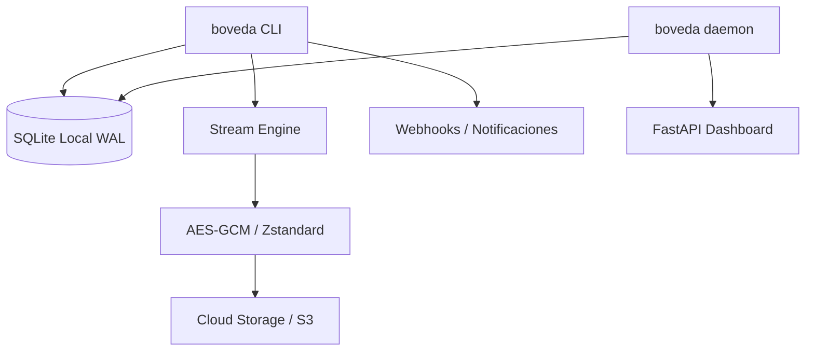

# Architecture: Bóveda PyME

## 1. Project Structure

```text
boveda-pyme/
├── src/boveda/
│   ├── api.py           # Dashboard FastAPI local para monitoreo de estado
│   ├── cli.py           # Orquestador (Click), comandos backup, restore, daemon, verify
│   ├── crypto.py        # Cifrado AES-256-GCM y hashing (Argon2, SHA-256)
│   ├── engine.py        # Motor de streaming Zstandard sin micro-chunking
│   ├── fsm.py           # Máquina de estados finitos (IN_PROGRESS, COMPLETED, FAILED)
│   ├── restore.py       # Descarga e inyección del stream descifrado al local
│   ├── retention.py     # Lógica GFS (Grandfather-Father-Son) y purga de expirados
│   └── storage.py       # Interfaz S3 vía aioboto3 con tenacity backoff
├── tests/               # Pruebas (unitarias, integración y e2e con MinIO)
└── scripts/             # Empaquetado PyInstaller y despliegue systemd
```

## 2. High-Level System Diagram



## 3. Core Components

### 3.1 Streaming Engine (Tolerancia a OOM)
Procesa archivos de tamaño ilimitado inyectándolos en un buffer estricto de 8MB en `engine.py`. El chunk se comprime (Zstd), cifra (AES-GCM con AAD = Header + Snapshot ID) y se envía al almacenamiento. Memoria controlada < 45MB en todo momento.

### 3.2 Storage Layer (Tolerancia a Red)
`storage.py` gestiona un pool de conexiones optimizado usando `aioboto3.Session`. Cada operación S3 está rodeada por bloqueadores `tenacity` implementando **Exponential Backoff with Jitter** para sobrevivir a los Rate Limits (503 Slow Down) o micro-cortes.

### 3.3 Deduplicación en Base de Datos (Tolerancia a redundancia)
La DB registra cada hash criptográfico de los chunks generados. Si un chunk ya existe, se reutiliza su `storage_key` referenciándolo en SQLite y se omite la llamada POST a S3. Para soportar concurrencia intensiva se usa `BEGIN IMMEDIATE`.

## 4. Data Stores

- **Local SQLite (Modo WAL):** Mantiene el inventario de backups, bloques, política GFS y KEK maestras.
- **S3 / Compatible (MinIO/AWS):** Destino inmutable para los blobs binarios cifrados.

## 5. Deployment & Infrastructure

- Empaquetado como demonio `systemd` y binarios autocontenidos.
- No se requiere una base de datos externa ni memoria RAM excesiva, ideal para edge y servidores PYME legacy.

## 6. Security

- Master Salt local + Password = KEK generada por Argon2.
- AAD (Additional Authenticated Data) liga cada chunk de 8MB al Snapshot ID previendo swapping malicioso.
- PII sanitizado por defecto vía `structlog` (logging estructurado en JSON).

