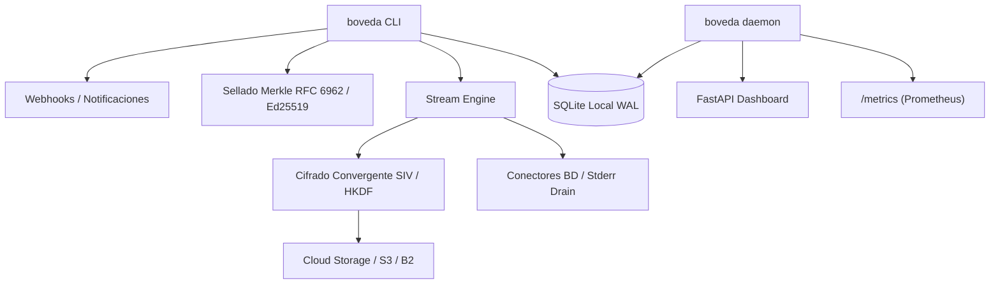

# Arquitectura: Bóveda PyME v0.2.0

## 1. Estructura del Proyecto

```text
boveda-pyme/
├── src/boveda/
│   ├── alerts.py        # Webhooks asíncronos y alertas JSON con timeout estricto
│   ├── api.py           # Dashboard FastAPI y endpoint de métricas Prometheus (/metrics)
│   ├── cli.py           # Orquestador (Click): backup, restore, rotate-kek, verify, daemon
│   ├── connectors.py    # Streaming robusto para PostgreSQL, MySQL, SQLite con drenaje de stderr
│   ├── constants.py     # Invariantes y constantes globales de compresión y buffering
│   ├── crypto.py        # Cifrado convergente SIV, HKDF-SHA256, AES-256-GCM y Argon2id
│   ├── database.py      # Esquema SQLite WAL, triggers DDL y catálogo chunk_pool normalizado
│   ├── engine.py        # Pipeline de streaming asíncrono con cola acotada O(1)
│   ├── fsm.py           # Máquina de estados finitos (IN_PROGRESS, COMPLETED, FAILED, EXPIRED)
│   ├── keys.py          # Abstracción KeyProvider (Argon2id, AWS KMS, Vault) y rotación atómica
│   ├── manifest.py      # Árboles de Merkle RFC 6962, JSON canónico RFC 8785 y firmas Ed25519
│   ├── restore.py       # Descarga e inyección del stream descifrado al destino local
│   ├── retention.py     # Purga atómica en dos fases (Two-Phase Soft-Delete) y FSM GFS
│   └── storage.py       # Interfaz asíncrona S3/B2 vía aioboto3 con backoff y reintentos
├── tests/               # Suite exhaustiva (unitarias, integración, concurrencia, e2e)
└── scripts/             # Empaquetado PyInstaller y unidad systemd con límite de memoria (45MB)
```

## 2. Diagrama de Arquitectura de Alto Nivel



## 3. Componentes Principales

### 3.1 Catálogo `chunk_pool` y Triggers de `ref_count`
- Normalización en dos entidades: `chunk_pool` (bloques físicos en S3) y `snapshot_chunks` (enlaces por snapshot).
- **Triggers SQLite a nivel kernel:** Incremento/decremento atómico de referencias y prevención de modificaciones/eliminaciones sucias (`RAISE(ABORT)`).

### 3.2 Purga Atómica Two-Phase Soft-Delete / Sweep
- **Fase 1:** Transición atómica de bloques con `ref_count == 0` a `PURGING_S3`.
- **Fase Intermedia:** Invocación masiva a S3 (`delete_objects`) **sin retener bloqueos de base de datos**.
- **Fase 2:** Eliminación física en SQLite o reversión automática ante fallos de red, garantizando **cero punteros colgantes (*Dangling Pointers*)**.

### 3.3 Conectores BD & Drenaje de Stderr
- Soporte nativo para PostgreSQL (`pg_dump -Fc`), MySQL (`mysqldump --single-transaction`) y SQLite (`sqlite3 .dump`).
- Corutina concurrente de drenaje continuo de `stderr` hacia un ring buffer circular de 64 KB, eliminando deadlocks por saturación de pipes del SO.
- Watchdog de streaming en dos fases (30s arranque / 60s inactividad) con manejo transparente de `SIGPIPE`.

### 3.4 Criptografía Convergente & Sellado Zero-Knowledge
- Cifrado determinista *Server-Aided Synthetic IV (SIV / DupLESS)* con claves derivadas vía HKDF ($K_{\text{dedup}}, K_{\text{id}}$).
- Árboles de Merkle conformes a RFC 6962 con separación de dominio (`0x00` hojas / `0x01` nodos internos).
- Serialización canónica determinista RFC 8785 y sellado asimétrico Ed25519 para auditoría legal sin necesidad de descifrar datos.
- Abstracción `KeyProvider` para Argon2id, AWS KMS y HashiCorp Vault, junto con rotación atómica de KEK (`rotate-kek`) sin mover datos en la nube.

### 3.5 Observabilidad de Cero Huella
- Endpoint `/metrics` nativo en formato texto OpenMetrics/Prometheus con consumo de memoria inferior a 180 KB.
- Telemetría en tiempo real de memoria residente (`RSS`), contadores de snapshots, total de bloques únicos y ratios de deduplicación.


